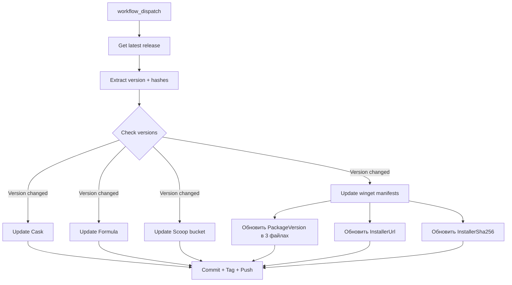

# План: Добавление публикации на winget в latest.yml

## Обзор

Добавить автоматическую генерацию/обновление манифестов winget для портативного приложения `abakum/crocson` при обновлении версии через workflow `latest.yml`.

## Структура winget манифеста

Winget требует 3 YAML-файла для каждого пакета. В нашем репозитории они будут храниться в директории `winget/`:

```
winget/
├── abakum.crocson.yaml              # Version manifest
├── abakum.crocson.installer.yaml    # Installer manifest  
└── abakum.crocson.locale.en-US.yaml # Locale manifest
```

### Схема обновления



## Изменения

### 1. Создать директорию `winget/` с шаблонами манифестов

#### `winget/abakum.crocson.yaml` — Version manifest
```yaml
PackageIdentifier: abakum.crocson
PackageVersion: 1.11.57
DefaultLocale: en-US
ManifestType: version
ManifestVersion: 1.9.0
```

#### `winget/abakum.crocson.installer.yaml` — Installer manifest
```yaml
PackageIdentifier: abakum.crocson
PackageVersion: 1.11.57
InstallerLocale: en-US
InstallerType: portable
Commands:
  - crocson
Installers:
  - Architecture: x64
    InstallerUrl: https://github.com/abakum/crocson/releases/download/v1.11.57/crocson.exe
    InstallerSha256: 702d7ad5f9b0b18837e48951f23b59a77e72fd93e9cf3a13e06ffccbfe80f038
    PortableCommandAlias: crocson
ManifestType: installer
ManifestVersion: 1.9.0
```

#### `winget/abakum.crocson.locale.en-US.yaml` — Locale manifest
```yaml
PackageIdentifier: abakum.crocson
PackageVersion: 1.11.57
PackageLocale: en-US
PackageName: crocson
Publisher: abakum
ShortDescription: GUI for croc - secure file transfer tool
Description: Crocson is a GUI for croc, a tool for securely transferring files and folders between computers.
License: ISC
LicenseUrl: https://github.com/abakum/crocson/blob/main/LICENSE
Homepage: https://github.com/abakum/crocson
Tags:
  - croc
  - file-transfer
  - gui
  - portable
ReleaseNotesUrl: https://github.com/abakum/crocson/releases/tag/v1.11.57
ManifestType: defaultLocale
ManifestVersion: 1.9.0
```

### 2. Изменить `.github/workflows/latest.yml`

#### 2a. Step `check_versions` — добавить проверку версии winget
- Читать `PackageVersion` из `winget/abakum.crocson.yaml`
- Сравнить с `LATEST_VERSION`
- Добавить `UPDATE_WINGET` и `CURRENT_VERSION_WINGET` в `GITHUB_OUTPUT`

#### 2b. Новый step `Update winget manifests` — обновление манифестов
- Условие: `if: steps.check_versions.outputs.UPDATE_WINGET == 'true'`
- Использовать Ruby для точной замены в YAML-файлах:
  - `PackageVersion` во всех 3 файлах
  - `InstallerUrl` в installer manifest
  - `InstallerSha256` в installer manifest
  - `ReleaseNotesUrl` в locale manifest

#### 2c. Step `Commit, tag and push` — добавить winget файлы
- Добавить `git add winget/` при `UPDATE_WINGET == true`
- Добавить `winget: <old_version>` в `COMMIT_PARTS`
- Добавить строку `Windows winget` в итоговый echo

### 3. Обновить `README.md`

Заменить секцию Windows:
```markdown
## How do I install on Windows?

### Via winget
- `winget install abakum.crocson`
- `winget upgrade abakum.crocson`

### Via scoop
- `scoop bucket add abakum https://github.com/abakum/homebrew-tap`
- `scoop bucket list`
- `scoop install crocson`
- `scoop update crocson`
```

## Порядок выполнения

1. Создать директорию `winget/` с тремя YAML-файлами манифеста
2. Обновить `.github/workflows/latest.yml` — добавить шаги для winget
3. Обновить `README.md` — добавить инструкцию winget
